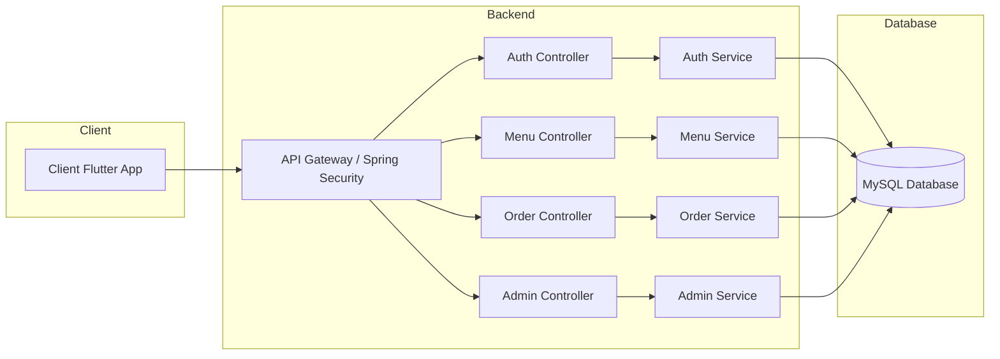

# ☕ CaféSmart: Your AI-Powered Cafeteria Companion

CaféSmart is a **Flutter**-powered mobile application with a **Spring Boot** backend that allows users to browse the cafeteria menu, place orders, and manage their account securely.

---

## 📌 Features
✅ User Authentication (JWT-based)  
✅ Role-based Access Control (User/Admin)  
✅ Menu Management (View, Add, Update, Delete)  
✅ Order Management (Place, View, Update, Cancel Orders)  
✅ Secure API Endpoints with **Spring Security & OAuth2**  

---

## 🚀 Tech Stack

### **Backend (Spring Boot)**
- **Spring Boot** (Java)
- **Spring Security** (JWT Authentication)
- **Spring Data JPA** (ORM)
- **MySQL** (Database)
- **Maven** (Build Tool)

### **Frontend (Flutter)**
- **Flutter** (Dart)
- **Provider** (State Management)
- **HTTP** (API Calls)
- **Shared Preferences** (Token Storage)

---

## 🛠️ Project Setup

### **1️⃣ Clone the Repository**
```
git clone https://github.com/yourusername/cafesmart.git
cd cafesmart
```
## 📌 Backend Setup (Spring Boot)

### **2️⃣ Configure Database**
1. Install **MySQL** and create a database named `cafesmart_db`.
2. Update `application.properties` in `src/main/resources/`:

   ```properties
   spring.datasource.url=jdbc:mysql://localhost:3306/cafesmart_db
   spring.datasource.username=root
   spring.datasource.password=yourpassword
   spring.jpa.hibernate.ddl-auto=update
   spring.jpa.show-sql=true
   spring.datasource.driver-class-name=com.mysql.cj.jdbc.Driver
   spring.jpa.database-platform=org.hibernate.dialect.MySQL8Dialect
   ```
3.Ensure MySQL is running and accessible.  
### **3️⃣ Build and Run the Backend**
```
mvn spring-boot:run
```
The API will run at: http://localhost:8080/

## 📌 API Endpoints

### **🔐 Authentication APIs**
| HTTP Method | Endpoint         | Description          | Role  |
|------------|-----------------|----------------------|-------|
| **POST**   | `/auth/login`    | User login (JWT)    | Public |
| **POST**   | `/auth/register` | User registration   | Public |

---

### **📋 Menu Management APIs**
| HTTP Method | Endpoint       | Description             | Role  |
|------------|---------------|-------------------------|-------|
| **GET**    | `/menu`       | View all menu items    | User/Admin |
| **POST**   | `/menu`       | Add new menu item      | Admin |
| **PUT**    | `/menu/{id}`  | Update menu item       | Admin |
| **DELETE** | `/menu/{id}`  | Delete menu item       | Admin |

---

### **🛒 Order Management APIs**
| HTTP Method | Endpoint        | Description             | Role  |
|------------|----------------|-------------------------|-------|
| **POST**   | `/orders`       | Place an order         | User  |
| **GET**    | `/orders`       | View all orders        | Admin |
| **GET**    | `/orders/{id}`  | View specific order    | Admin/User |
| **PUT**    | `/orders/{id}`  | Update order status    | Admin |

## 📌 Database Schema (MySQL)

### **1️⃣ `users` Table**
Stores user credentials, roles, and authentication details.

```sql
CREATE TABLE users (
    id BIGINT AUTO_INCREMENT PRIMARY KEY,
    username VARCHAR(50) UNIQUE NOT NULL,
    password VARCHAR(255) NOT NULL,
    role ENUM('USER', 'ADMIN') NOT NULL
);
```

### **2️⃣ menu_items Table**
Stores all available food and drink items.

```sql
CREATE TABLE menu_items (
    id BIGINT AUTO_INCREMENT PRIMARY KEY,
    name VARCHAR(100) NOT NULL,
    description TEXT,
    price DECIMAL(10,2) NOT NULL,
    category VARCHAR(50) NOT NULL
);
```
### **3️⃣ orders Table**
Stores customer orders with status updates.

```sql
CREATE TABLE orders (
    id BIGINT AUTO_INCREMENT PRIMARY KEY,
    username VARCHAR(50) NOT NULL,
    items TEXT NOT NULL,  -- List of items ordered
    total_price DECIMAL(10,2) NOT NULL,
    status ENUM('PENDING', 'COMPLETED', 'CANCELLED') DEFAULT 'PENDING',
    FOREIGN KEY (username) REFERENCES users(username) ON DELETE CASCADE
);
```

## 🧩 Flow Diagram


🚀 CaféSmart – Making Cafeteria Management Smarter & Faster! ☕
